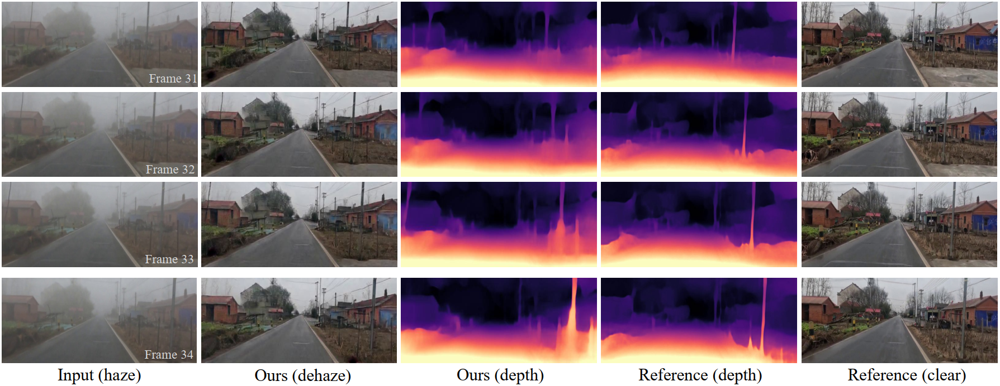

<div align="center">

<h1>Depth-Centric Dehazing and Depth-Estimation from Real-World Hazy Driving Video</h1>

<div>
    <a href='https://fanjunkai1.github.io/' target='_blank'>Junkai Fan</a><sup>1</sup>&emsp;
    <a href='https://github.com/w2kun' target='_blank'>Kun Wang</a><sup>1</sup>&emsp;
    <a href='https://yanzq95.github.io/' target='_blank'>Zhiqiang Yan</a><sup>1</sup>&emsp;
    <a href='https://cschenxiang.github.io/' target='_blank'>Xiang Chen</a><sup>1</sup>&emsp;
    <a target='_blank'>Shangbing Gao</a><sup>2</sup>&emsp;
    <a href='https://scholar.google.com/citations?user=iGPEwQsAAAAJ&hl=zh-CN' target='_blank'>Jun Li</a><sup>1</sup>&emsp;
    <a href='https://scholar.google.com/citations?user=6CIDtZQAAAAJ&hl=zh-CN' target='_blank'>Jian Yang</a><sup>1</sup>
</div>

<div>
    <sup>1</sup>PCA Lab, Nanjing University of Science and Technology<br><sup>2</sup>Huaiyin Institute of Technology
</div>

<div>
    <h4 align="center">
        <a href="" target='_blank'>AAAI 2025</a>
    </h4>
</div>
</div>


We propose a novel depth-centric learning framework that integrates the atmospheric scattering model (ASM) with the brightness consistency constraint (BCC) constraint. Our key idea is that both ASM and BCC rely on a shared depth estimation network. This network simultaneously exploits adjacent dehazed frames to enhance depth estimation via BCC and uses the refined depth cues to more effectively remove haze through ASM.



## 📢 News
- [13-12-2024] We created the [project homepage](https://fanjunkai1.github.io/projectpage/DCL/index.html) and the GitHub README.

## 🎬 Video demo
To demonstrate the stability of the proposed method, we separately compared it with the latest SoTA video dehazing (e.g., MAP-Net, DVD) and monocular depth estimation methods (e.g., Mono-ViFI, Lite-Mono) on GoProHazy. 

https://github.com/user-attachments/assets/55369027-acf9-4e47-83a8-dfa2f982bdfc


## ⚙️ Dependencies and Installation

### Initialize Conda Environment and Clone Repo
```bash
git clone https://github.com/fanjunkai1/DCL.git

conda create -n DCL python=3.9.19
conda activate DCL

conda install pytorch==1.11.0 torchvision==0.12.0 torchaudio==0.11.0 cudatoolkit=11.3 -c pytorch

```

### Intall Dependencies

```bash
pip install -r requirements.txt
```


